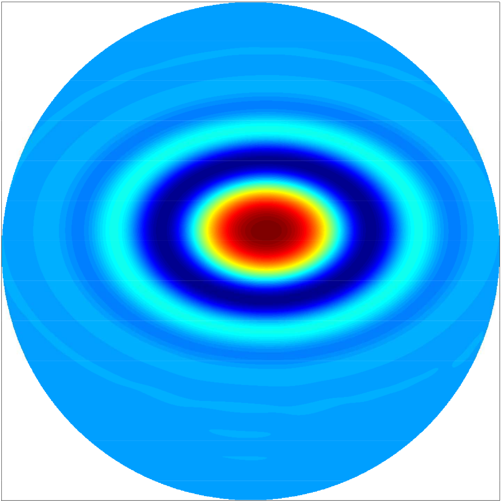
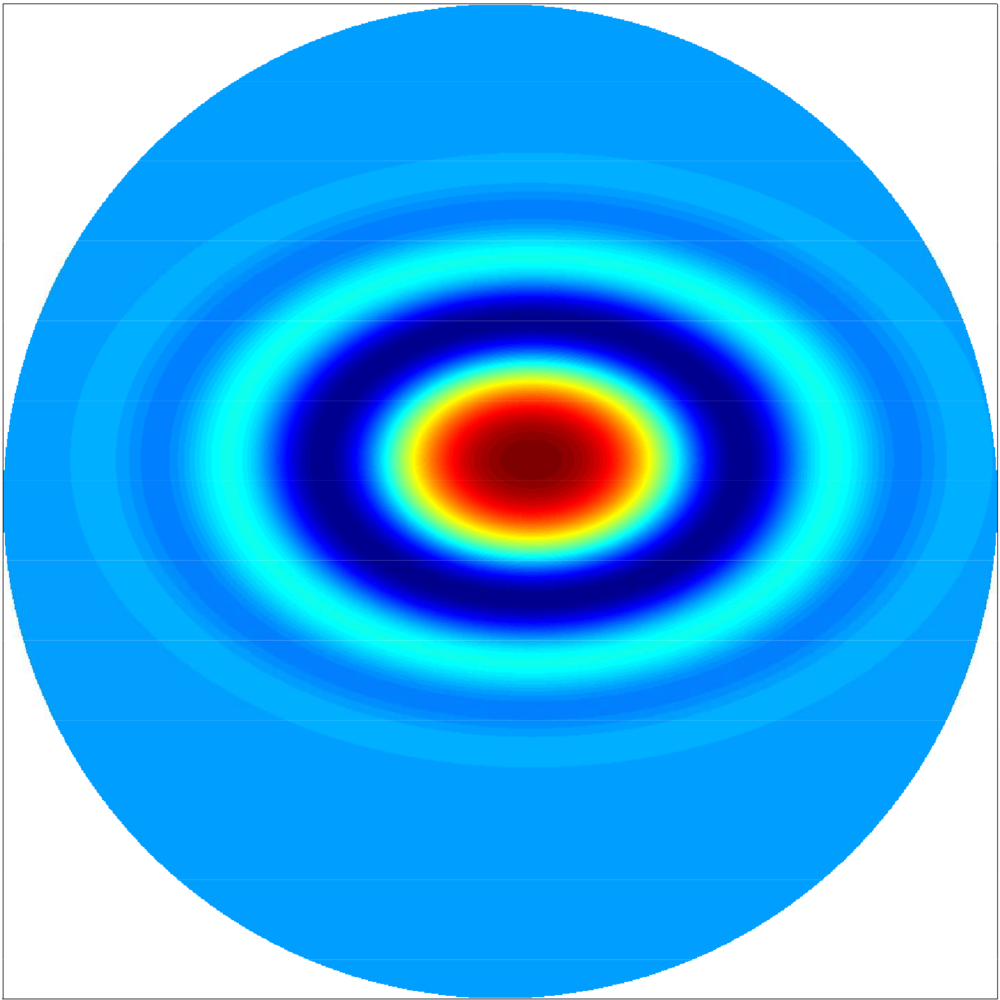
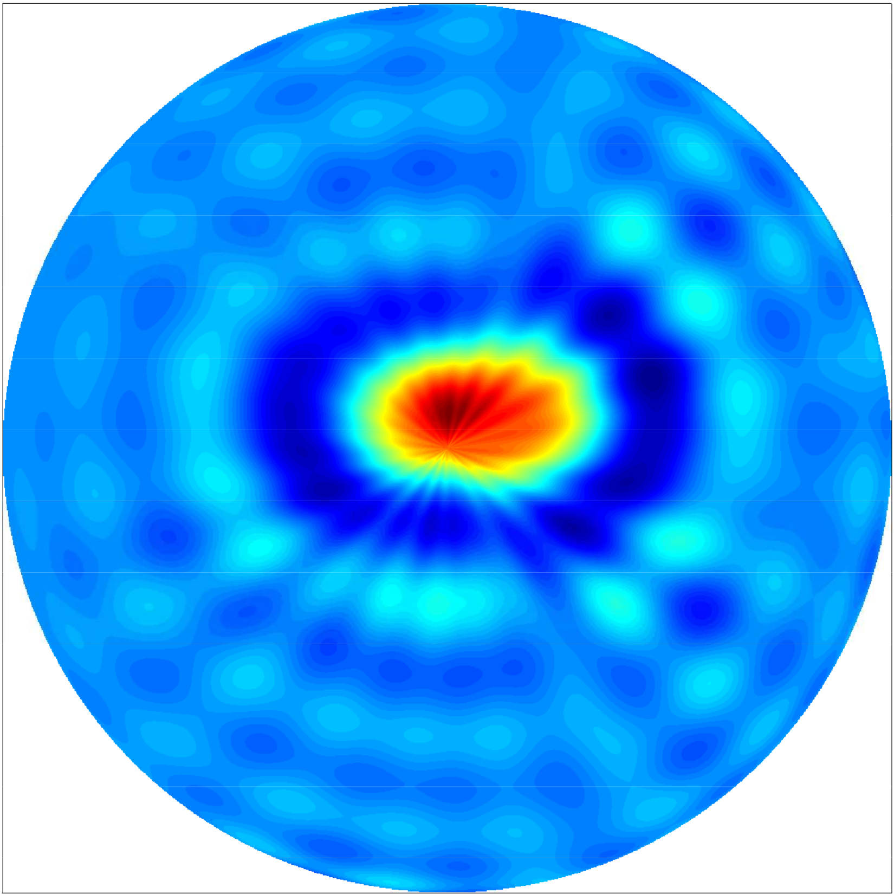
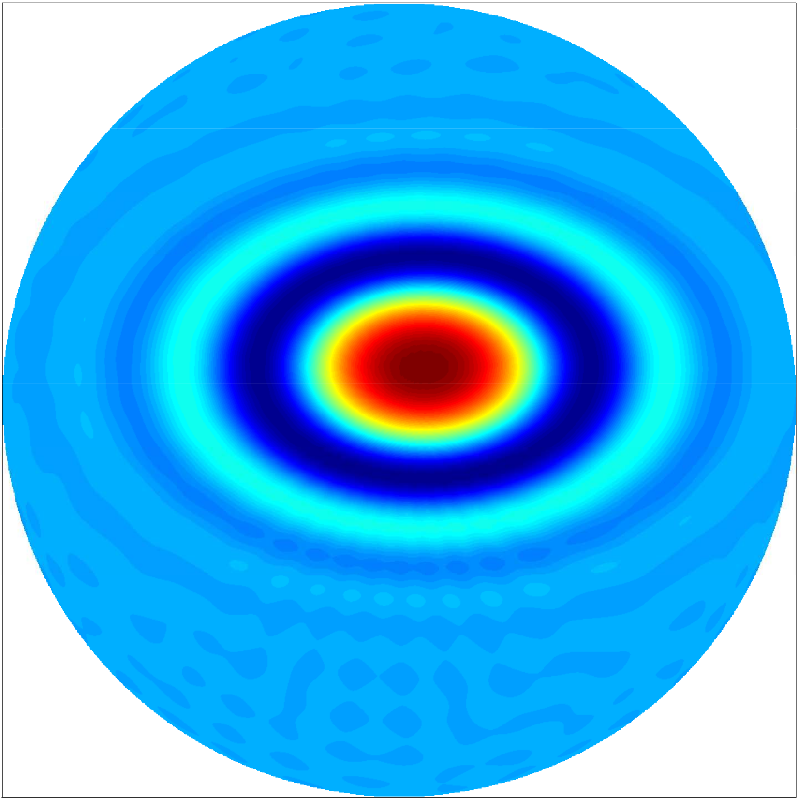

# RDisk

Spectral interpolation on the unit disk at the nodes of rhodonea curves
--------------------------------------------------------------------------------

Version: 0.2 (01.09.2018)

Written by <a href="http://www.math.unipd.edu/~erb/index.html"> Wolfgang Erb</a>

&nbsp;&nbsp;&nbsp;&nbsp;&nbsp;&nbsp;&nbsp;&nbsp;&nbsp; &nbsp;&nbsp; &nbsp;&nbsp;&nbsp;&nbsp;&nbsp;&nbsp;&nbsp;&nbsp;&nbsp; &nbsp;&nbsp;  
Fig.1. Illustration of two rhodonea varieties. Left: A single rhodonea curve. Right: A rhodonea variety composed of 8 circles. 

Description
-----------

The toolbox RDisk contains a Matlab-implementation for the computation of a spectral interpolation on the unit disk from data given at the nodes of rhodonea or rose curves. The description of the rhodonea curves, the rhodonea node sets and the spectral interpolation scheme are given in [1]. 

  

&nbsp;&nbsp;&nbsp;&nbsp;&nbsp;&nbsp;&nbsp;&nbsp;&nbsp; &nbsp;&nbsp; &nbsp;&nbsp;&nbsp;&nbsp;&nbsp;&nbsp;&nbsp;&nbsp;&nbsp; &nbsp;&nbsp;  

  

- To **test** the package use **example_main.m**

- To **plot** the rhodonea varieties and the rhodonea interpolation nodes consisting of intersection and boundary points use **plot_rhodonea.m**

- To **plot** the Lagrange functions of the interpolation scheme use **example_lagrange.m**

- To **plot** the Chebyshev-Fourier basis involved in the interpolation try **navigator_nls_example.m**

  

 &nbsp;&nbsp;&nbsp;&nbsp;&nbsp;&nbsp;&nbsp;&nbsp;&nbsp; &nbsp;&nbsp; &nbsp;&nbsp;&nbsp;&nbsp;&nbsp;&nbsp;&nbsp;&nbsp;&nbsp; &nbsp;&nbsp; 

  

 &nbsp;&nbsp;&nbsp;&nbsp;&nbsp;&nbsp;&nbsp;&nbsp;&nbsp; &nbsp;&nbsp; &nbsp;&nbsp;&nbsp;&nbsp;&nbsp;&nbsp;&nbsp;&nbsp;&nbsp; &nbsp;&nbsp; 

  

Citation and Credits
--------------------

The general construction of the interpolation scheme based on the node points of spherical Lissajous curves is introduced in 

*   [1] &nbsp; Erb, W.  
    <i> Rhodonea curves as sampling trajectories for spectral interpolation on the unit disk </i>  
    arXiv:1802.06546 [math.NA] (2018) 

License
-------

Copyright (C) 2018 Wolfgang Erb

This software was written by Wolfgang Erb at the University of Hawaii at Manoa and at the University of Padova

RDisk is free software: you can redistribute it and/or modify
it under the terms of the GNU General Public License as published by
the Free Software Foundation, either version 3 of the License, or
(at your option) any later version.

This program is distributed in the hope that it will be useful,
but WITHOUT ANY WARRANTY; without even the implied warranty of
MERCHANTABILITY or FITNESS FOR A PARTICULAR PURPOSE.  See the
GNU General Public License for more details.

You should have received a copy of the GNU General Public License
along with this program. If not, see <http://www.gnu.org/licenses/>.
