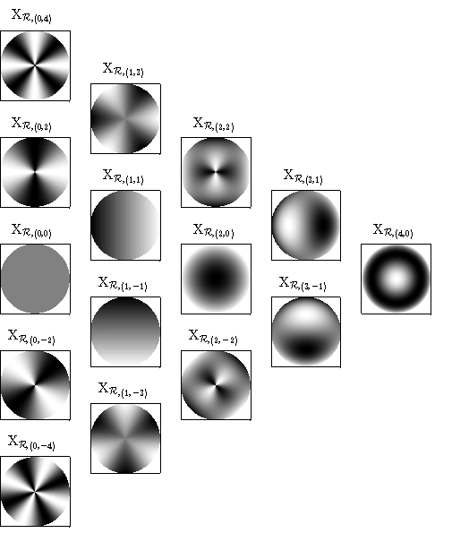

# RDisk

Spectral interpolation on rhodonea curves
--------------------------------------------------------------------------------

Version: 0.2 (01.09.2018)

Written by <a href="https://www.math.unipd.it/~erb/index.html"> Wolfgang Erb</a>

&nbsp;&nbsp;&nbsp;&nbsp;&nbsp;&nbsp;&nbsp;&nbsp;&nbsp; &nbsp;&nbsp; &nbsp;&nbsp;&nbsp;&nbsp;&nbsp;&nbsp;&nbsp;&nbsp;&nbsp; &nbsp;&nbsp;  
Fig.1. Illustration of two rhodonea varieties. Left: A single rhodonea curve. Right: A rhodonea variety composed of 8 circles. 

Description
-----------

The toolbox RDisk contains a Matlab-implementation for the computation of a spectral interpolation scheme on the unit disk from data samples at the nodes of one or several rhodonea curves [1]. 

Rhodonea curves are classical planar curves in the disk that have the characteristic shape of a petalled rose. Sampling along these curves gives node sets that are ideally suited to interpolate functions on the disk. The interpolation spaces are generated by a parity-modified Chebyshev-Fourier basis. One main advantage of this basis is the fact that the interpolant can be calculated efficiently by a fast Fourier transform. 
  

&nbsp;&nbsp;&nbsp;&nbsp;&nbsp;&nbsp;&nbsp;&nbsp;&nbsp; &nbsp;&nbsp; &nbsp;&nbsp;&nbsp;&nbsp;&nbsp;&nbsp;&nbsp;&nbsp;&nbsp; &nbsp;&nbsp;  
Fig.2. Chebyshev-Fourier basis functions on the disk spanning a rectangular (left) and a triangular (right) interpolation space.  

  

- To **test** the package use **example_main.m**

- To see how the interpolation scheme can be **applied** to the black hole data from the EHT collaboration have a look at **example_blackhole.m**

- To **compare** interpolation on the rhodonea nodes with a tensor-product interpolation scheme on the disk try **example_RDvsTPD.m**

- To **plot** the Lagrange functions of the interpolation scheme use **example_lagrange.m**

- To **plot** the rhodonea varieties and the rhodonea interpolation nodes consisting of intersection and boundary points use **plot_rhodonea.m**

- To **plot** the Chebyshev-Fourier basis involved in the interpolation try **plot_basisfunction.m**

  

    
Fig.3. Increasing approximation quality of the interpolation scheme black hole data (EHT collaboration et al.).

  

    
Fig.4. Approximation errors of the interpolants in Fig. 3. with respect to the original black hole image. 

  

Citation and Credits
--------------------

The analysis of the rhodonea nodes and the construction of the corresponding spectral interpolation scheme on the disk can be found in 

*   [1] &nbsp; Erb, W.  
    <i> Rhodonea curves as sampling trajectories for spectral interpolation on the unit disk </i>  
    arXiv:1812.xxxxx [math.NA] (2018) 

License
-------

Copyright (C) 2018 Wolfgang Erb

This software was written by Wolfgang Erb at the University of Hawaii at Manoa and at the University of Padova

RDisk is free software: you can redistribute it and/or modify
it under the terms of the GNU General Public License as published by
the Free Software Foundation, either version 3 of the License, or
(at your option) any later version.

This program is distributed in the hope that it will be useful,
but WITHOUT ANY WARRANTY; without even the implied warranty of
MERCHANTABILITY or FITNESS FOR A PARTICULAR PURPOSE.  See the
GNU General Public License for more details.

You should have received a copy of the GNU General Public License
along with this program. If not, see <http://www.gnu.org/licenses/>.
